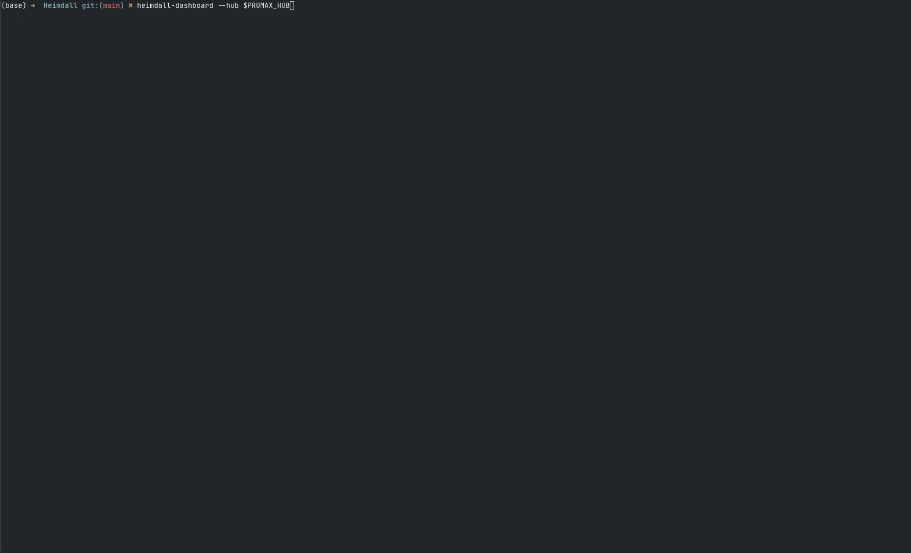
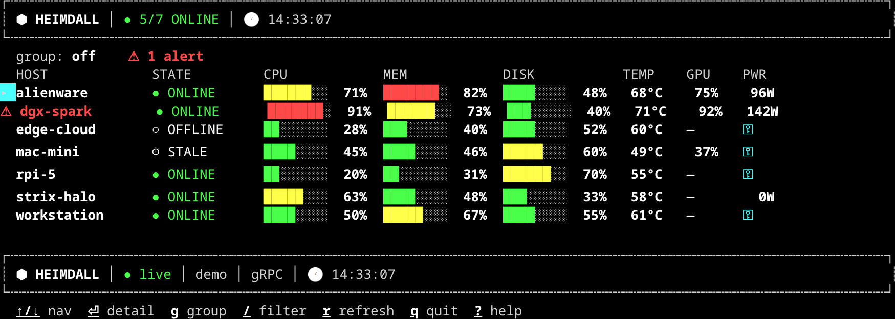

<p align="center">
  
</p>

<h1 align="center">Heimdall</h1>

<p align="center"><em>Watch Over All Realms</em></p>

<p align="center">
  
  
  
  
</p>

<p align="center">
  <b>🎉 v2.0.0 — the <em>everything socket</em> release.</b> On-demand commands, in-dashboard
  logs &amp; live process view, and a JSON CLI — all over the daemon's single outbound stream,
  with <b>no inbound port on any host</b>. → <a href="docs/releases/v2.0.0.md">Release notes</a>.
</p>

---

Heimdall is a lightweight, cross-platform **hardware monitoring** system with a real-time
**terminal dashboard**. Unprivileged daemons stream metrics from every host over a low-bandwidth
gRPC link to a central hub; a btop/mactop-class Go TUI renders the fleet live. It **sees** (metrics)
and **hears** (opt-in logs) across every realm.

Point it at your homelab, GPU boxes, a rack of servers, or just your laptop, and watch CPU,
memory, disk, network, temperature, GPU, and power from every machine in one terminal.

<p align="center">
  
</p>

<p align="center">
  <br>
  <sub>The fleet grid — every host's state, CPU/MEM/DISK/TEMP/GPU/PWR, live. <code>--demo</code> shown.</sub>
</p>

## Why Heimdall?

- **One terminal for the whole fleet** — not a separate btop/mactop window per box.
- **Lightweight** — four small static binaries. No Prometheus + Grafana + exporters + a
  time-series database to stand up (though Heimdall speaks OpenMetrics if you already run them).
- **Unprivileged by default** — hosts need no inbound ports and no root. Power, GPU, and thermal
  come from no-sudo paths where they exist, and an optional helper where they don't.
- **Built for distance** — compact gRPC over a low-bandwidth link; happy across a VPN or Tailscale.
- **Scriptable & agent-friendly** — `heimdall-cli` emits typed JSON, so scripts, CI/CD, and AI agents
  read the fleet without screen-scraping. Drop in the copy-paste agent/skill/command files and ask
  *"check my fleet"* in plain English — same lightweight binary, no extra service.
  See [real agent sessions](docs/guides/11-hub-cli.md#what-it-looks-like-in-practice).
- **Zero-config when you want it** — daemons can discover their hub over mDNS; tag hosts to organize
  a growing fleet; alert on thresholds; scrape it all into your existing Grafana.

## Capabilities

Feature codenames are Norse — see the [glossary](docs/glossary.md) for what they mean and how to say them.

- **Cross-platform daemon** — Windows/macOS/Linux × amd64/arm64; enrolls over TLS, auto-reconnects, low bandwidth.
- **SOLID metric adapters** — CPU (with per-core), memory, disk + disk I/O, network throughput, temperature, GPU, power, internet + per-NIC gateway latency, uptime, host context. New signals add without touching existing adapters; a failing adapter is isolated, never dropping the host.
- **Unprivileged by default** — power, GPU, and thermal from no-sudo paths (Apple Silicon IOReport, Linux RAPL + hwmon) and an optional helper for the rest; adapters self-report `unavailable` / `needs-helper` rather than failing.
- **Real-time TUI** — live grid, per-host detail, gradient gauges, stale/offline with last-known values; high-fidelity and graceful-degradation render modes.
- **Bifröst federation** — a hub relays upstream (local → cloud); multiple dashboards subscribe to one hub.
- **Ratatoskr discovery** — daemons find their hub over mDNS (`--hub auto`); no hardcoded address on a LAN.
- **Realms tags** — tag hosts and hubs (`env=prod`, `region=apac`); hub tags inherit to their hosts, and the fleet is groupable by tag or origin hub.
- **Mímir export** — a Prometheus/OpenMetrics `/metrics` endpoint over the whole fleet, plus short-range history, so it drops into an existing Grafana.
- **Gjallarhorn alerting** — declarative threshold rules with hysteresis; fire to a webhook on breach and clear.
- **Heimdallr's sight — in-dashboard observability** — read a host's **logs** (`l`, with `/` search) and a live **process table** (`t`, sortable with `s`) right in the TUI. Pushed through the hub; **no daemon listens**.
- **On-demand commands (v2)** — read-only, allow-listed diagnostics (`process.list`, `disk.df`, `uptime`, `os.info`, `dir.list`, plus privileged `dmesg`/`journal.tail`) run via the hub and routed down the daemon's outbound stream; privileged ones delegate to the root helper. Opt-in per daemon (`--allow-commands`), audited. From the dashboard (`c`) or `heimdall-cli run`.
- **`heimdall-cli`** — a machine- & AI-friendly **JSON** client for scripts, CI/CD, and agents: `heimdall-cli hosts | top | logs | run …`, with copy-paste agent/skill files.

## Quick start

Monitor your own machine — build, then run all three pieces locally:

```sh
make build-tui
./bin/heimdall-hub &                                               # central server (:9090)
./bin/heimdall-daemon --hub localhost:9090 --name "$(hostname)" &  # collector
./bin/heimdall-dashboard                                           # the TUI (subscribes to :9090)
```

Just want to see the interface? `./bin/heimdall-dashboard --demo` renders a
simulated fleet — no hub or daemon needed.

→ Full walkthrough: **[Quickstart](docs/guides/01-quickstart.md)**.

## How it works

Heimdall separates **collection** from **presentation**:

```
 host(s):  heimdall-daemon  ─┐
           (+ heimdall-helper, optional, root)
                             ├─►  heimdall-hub  ─►  heimdall-dashboard (×N)
                             │     (station)        (pure presentation)
```

| Binary | Runs on | Job |
|---|---|---|
| `heimdall-hub` | monitoring station | receives metrics, fans out to dashboards |
| `heimdall-dashboard` | monitoring station (any number) | renders the fleet — collects nothing itself |
| `heimdall-daemon` | every host | collects + streams this host's metrics; pushes opt-in logs/processes |
| `heimdall-helper` | a host (optional, root) | serves privileged metrics + runs privileged allow-listed commands for the daemon |
| `heimdall-cli` | anywhere | machine/AI-friendly JSON client over a hub (scripts, CI/CD, agents) |

Clean Architecture over a single Go module. The versioned gRPC contract in
[`common/proto/monitoring/v1`](common/proto/monitoring/v1) is the single source of truth shared by
every binary. Full design in [`docs/specs/current/architecture.md`](docs/specs/current/architecture.md)
and the [ADRs](docs/architecture/); architecture & operations overview with diagrams in
[`docs/deployment.md`](docs/deployment.md).

## Documentation

Full docs live in **[`docs/`](docs/README.md)**.

**Start guides — by what you want to do:**

| Guide | Use it when you want to… |
|---|---|
| [Quickstart](docs/guides/01-quickstart.md) | watch a single machine (all-in-one) |
| [Monitor a Fleet](docs/guides/02-monitor-a-fleet.md) | watch many hosts from one station |
| [Secure Deployment](docs/guides/03-secure-deployment.md) | require TLS + an enrollment token |
| [Privileged Metrics](docs/guides/04-privileged-metrics.md) | unlock power, GPU, and full thermal |
| [Federation (Bifröst)](docs/guides/05-federation.md) | span multiple sites / networks |
| [Process View & Commands](docs/guides/06-control-plane.md) | see a host's process table (top) and run allow-listed diagnostics |
| [Log Streaming](docs/guides/07-log-streaming.md) | tail host logs in the dashboard |
| [Demo Mode](docs/guides/08-demo-mode.md) | explore the UI with no setup |
| [Metrics Export (Mímir)](docs/guides/09-metrics-export.md) | scrape Heimdall from Prometheus / Grafana |
| [Alerting (Gjallarhorn)](docs/guides/10-alerting.md) | fire threshold alerts to a webhook |
| [`heimdall-cli` (programmatic & agents)](docs/guides/11-hub-cli.md) | query the fleet from scripts, CI/CD, or an AI agent |

**Reference:** [Installation](docs/installation.md) ·
[Configuration](docs/configuration.md) ·
[Metrics](docs/metrics.md) ·
[Glossary](docs/glossary.md) ·
[Architecture & Operations](docs/deployment.md) ·
[Troubleshooting](docs/troubleshooting.md) ·
[Changelog](CHANGELOG.md)

## Install

Prebuilt binaries are published to [GitHub Releases](https://github.com/kinncj/Heimdall/releases)
for Linux/macOS/Windows × amd64/arm64. Install only what each machine needs —
`heimdall-hub` + `heimdall-dashboard` on the station, `heimdall-daemon` on each host. Binaries go
to the system bin dir (`/usr/local/bin`) by default; pass `--install-location <dir>` to change it.

```sh
# Dashboard (on the monitoring station)
curl -fsSL https://raw.githubusercontent.com/kinncj/Heimdall/main/scripts/install.sh | sh -s -- dashboard

# Daemon (on each host)
curl -fsSL https://raw.githubusercontent.com/kinncj/Heimdall/main/scripts/install.sh | sh -s -- daemon

# A user-local dir instead of /usr/local/bin
curl -fsSL .../scripts/install.sh | sh -s -- --install-location ~/.local/bin daemon

# heimdall-cli (scripts, CI/CD, agents — anywhere that talks to a hub)
curl -fsSL https://raw.githubusercontent.com/kinncj/Heimdall/main/scripts/install.sh | sh -s -- cli
```

On Windows, use [`install.ps1`](scripts/install.ps1): `irm https://raw.githubusercontent.com/kinncj/Heimdall/main/scripts/install.ps1 | iex`.

Already installed? Each binary self-updates: `heimdall-dashboard update`. Check a build with
`heimdall-<binary> --version`. Or build from source (`make build-tui`). See
**[Installation](docs/installation.md)** for version pinning, `go install`, and more.

## Build & test from source

```sh
make build-tui        # builds bin/heimdall-{dashboard,daemon,hub,helper}
make run-tui          # dashboard subscribing to a hub (localhost:9090)
make run-demo         # dashboard with a simulated fleet (no hub needed)
make test             # unit tests
make lint             # gofmt + go vet
make test-acceptance  # behave acceptance suite (drives the real binaries)
```

## Contributing

Contributions are welcome — a new metric adapter, a platform port, a guide, a bug fix.
Heimdall is a single Go module with Clean Architecture and a story-driven workflow:

- Every feature begins as a Gherkin story in [`docs/stories/`](docs/stories) — the story is the spec.
- Significant decisions are written up as [ADRs](docs/architecture/).
- Tests come first (TDD); `make test` and `make test-acceptance` must pass.
- Commits follow [Conventional Commits](https://www.conventionalcommits.org/) (`feat:`, `fix:`, `docs:`, …).

Good first contributions:

- **Add a metric adapter** — one file, one interface, isolated from the rest. See
  [ADR 0003](docs/architecture/0003-metric-adapter-contract-and-failure-isolation.md).
- **Port the privileged helper** to another platform (the Linux RAPL/hwmon path is a worked example).
- **Improve a guide** in [`docs/guides/`](docs/guides).

Browse the [open issues](https://github.com/kinncj/Heimdall/issues) and the
[CHANGELOG](CHANGELOG.md) to see where Heimdall is heading.

## License

[AGPL-3.0-or-later](LICENSE) © Kinn Coelho Juliao &lt;kinncj@gmail.com&gt;

---

<p align="center"><sub>Built with ♥ and <a href="https://github.com/kinncj/MAPLE">Maple</a>.</sub></p>
