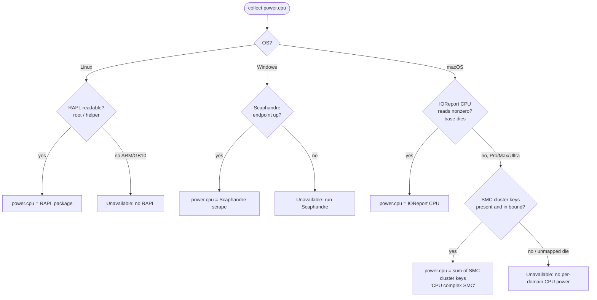

# 0021 — Power metric standardization (cpu/gpu/total) and per-platform source layering

## 1. Context

Power reporting had grown platform-specific and inconsistent, and fleet
observation surfaced concrete wrongness:

- `power.pkg` meant **"CPU package"** on Linux (RAPL) but **"whole system"** on
  macOS (SMC `PSTR`), so the same key was not comparable across hosts.
- On Linux `power.cpu` was the RAPL *core* subdomain while `power.pkg` was the
  package — two CPU-ish numbers that didn't reconcile.
- **AMD APU (Strix Halo)** under-reported: only the amdgpu rail showed, so a box
  that btop measured at ~139 W read ~52 W.
- A busy discrete GPU (RTX PRO 6000 at ~500 W) was hidden behind a ~30 W CPU
  package figure, because the panel headlined `power.pkg`.
- **Apple Pro/Max** appeared to have no CPU power at all — IOReport and
  `powermetrics` both report `CPU Power: 0 mW` there.
- **Windows** had no CPU power path.

The metric-adapter contract (ADR-0003) and the optional privileged helper
(ADR-0004) still hold; this decision layers on top of them.

## 2. Goals / Non-Goals

**Goals:**
- One comparable power model on every OS/chip: `power.cpu`, `power.gpu`,
  `power.total`.
- Read the *best available* source per platform; never fabricate a value.
- Explain every missing reading (Unavailable-with-reason), never a silent blank.
- Backward compatible across a mixed-version fleet.

**Non-Goals:**
- Shipping our own kernel driver (Windows RAPL) — we read a user-installed one.
- A full per-chip SMC key map for every Apple SoC (we map what we can verify).
- Per-core wattage (no vendor exposes it; see §5).

## 3. Proposal

**Standard trio, everywhere:**
- `power.cpu` — CPU power (the whole CPU complex).
- `power.gpu` — GPU power.
- `power.total` — whole machine. Retire `power.pkg`.

**Per-platform source, layered (first that yields a value wins):**

| Platform | `power.cpu` | `power.total` |
|---|---|---|
| Linux (Intel/AMD) | RAPL package (root, via helper) | `cpu + gpu (+ npu)` |
| Linux (ARM/GB10) | Unavailable — no RAPL | `gpu` |
| Windows | Scaphandre scrape (its Hubblo RAPL driver) | `cpu + gpu` |
| macOS **base** (M1–M4) | IOReport per-domain CPU | SMC `PSTR` |
| macOS **Pro/Max/Ultra** | raw SMC cluster keys (`PC02+PC03+PC42+PC43` on M3 Max) | SMC `PSTR` |

`power.total` is a source-aware sum: on Apple it is the SMC whole-system rail
directly (never `cpu+gpu`, which would double-count); everywhere else the GPU is
a physically separate rail, so it is `cpu + gpu (+ npu)`.

**`power.cpu` source selection (first that yields a value wins):**

The macOS path is the novel one: base dies report CPU power through IOReport, but
Pro/Max/Ultra report `0` there, so Heimdall falls to the raw SMC cluster keys with
a sanity bound (below) before giving up.

**Apple SMC per-domain CPU** (the key novelty): the IOReport energy model reports
0 for CPU on Pro/Max, but the raw AppleSMC per-cluster power keys still carry it
(the same source Stats reads). `smcReadFloat(key)` reads any AppleSMC `flt ` key;
`smcCPUPower()` sums the CPU cluster keys, **gated by a sanity bound** (reject
NaN/Inf/negative/`>200 W`) so a chip whose keys mean something else falls back to
Unavailable rather than showing garbage.

**Helper is in-process-first:** the daemon reads privileged metrics itself first;
it only consults the helper when it *can't* read a CPU power rail (an unprivileged
Linux daemon needing RAPL). On macOS the daemon has power via SMC/IOReport, so it
never calls the (slow, `powermetrics`-bound) helper — running the helper on Apple
Silicon is harmless.

## 4. Alternatives Considered

| Option | Pros | Cons | Why Rejected |
|---|---|---|---|
| Keep platform-specific names (`power.pkg` etc.) | no churn | not comparable across fleet; APU under-count persists | the whole point is comparability |
| Ship our own Windows RAPL driver | works standalone | kernel-signing, liability, maintenance | read Scaphandre's signed driver instead |
| Full per-chip Apple SMC key map (Stats-style) | accurate on every chip | large, ongoing reverse-engineering | verify what we have; safe fallback elsewhere |
| Helper-first (prior behaviour) | one source of truth | a slow helper (macOS `powermetrics`) blanks *all* privileged metrics | in-process-first + bounded helper |
| Naive `power.total = pkg + gpu` on all | simple | double-counts Apple SMC total and AMD-APU integrated GPU | source-aware sum |

## 5. Trade-offs and Risks

- **Reverse-engineered SMC keys are per-generation.** Verified on M3 Max; other
  Pro/Max dies may use different keys. Mitigated: sanity bound + IOReport-first +
  Unavailable fallback — never a wrong number, worst case an honest dash.
- **`power.cpu` on Apple Pro/Max is the CPU-cluster sum**, labelled
  `CPU complex (SMC)` — it is the P/E cluster rails, close to but not a
  vendor-blessed "package" figure.
- **In-process-first costs a redundant `nvidia-smi` on Linux** (in-process, then
  the helper) — a few hundred ms per cycle at the collector cadence. Acceptable.
- **No per-core wattage anywhere** — Apple SMC is per-cluster, Intel/AMD RAPL is
  per-package/domain. Per-core *utilisation* exists; per-core power does not.
- **Mixed-version fleet** during rollout: an un-updated host emits the old key and
  reads the old way until upgraded. Transient, non-breaking.

## 6. Impact

**FinOps:** none — all reads are local, unprivileged where possible; no new
services except the operator-chosen Scaphandre on Windows.

**SRE:** strictly safer. The helper can no longer blank a host under latency; every
gap explains itself; a mis-mapped chip degrades to Unavailable, not garbage.
Recovery for a wrong reading is "it can't happen" (bounded + fallback).

**Security:** all Apple/Linux reads are unprivileged (AppleSMC, IOReport, sysfs
RAPL via the root helper). Windows depends on the operator installing Scaphandre's
signed driver — a documented, user-controlled dependency, not shipped by us.

**Team:** new-chip support = probe the SMC keys on that machine and add them
(§Next Steps). The SMC key catalogue is reverse-engineered and needs occasional
maintenance, exactly like Stats' per-chip temperature keys.

## 7. Decision

Standardize power on `power.cpu` / `power.gpu` / `power.total` across every
platform, sourced by a layered, best-available strategy and a source-aware total
that never double-counts. Read Apple Pro/Max CPU power from the raw SMC cluster
keys (with a sanity bound), read Windows CPU power from a user-run Scaphandre, and
make the helper in-process-first so it is additive, never subtractive. Retire
`power.pkg`; explain every unavailable rail. Backward compatibility is a hard
constraint met by keeping the metric schema stable. Shipped across v2.3.0–v2.5.2
and verified live on Intel/AMD Linux, Windows, and Apple base (M4) + Pro/Max (M3
Max).

Status: **accepted**

## 8. Next Steps

- [ ] Map SMC CPU keys for more Apple dies (M1/M2/M4 Pro/Max, Ultra) as hardware
      is available; unmapped chips already fall back safely.
- [ ] Top view: per-core % grid labelled by core type (P/E), plus per-cluster
      power where the SMC exposes it.
- [ ] Multi-GPU per-device breakout (currently aggregated).
