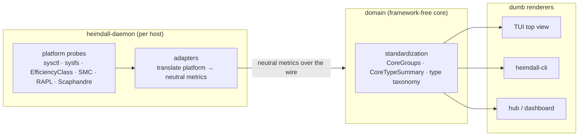

# 0022 — Metric standardization boundary: adapters normalise, consumers render

## 1. Context

Heimdall watches a heterogeneous fleet: Apple Silicon (base + Pro/Max), Intel
(hybrid and pre-hybrid), AMD, and ARM, across macOS, Linux, and Windows. Each
platform names and exposes the same physical quantity differently — CPU power is
SMC keys on Apple, RAPL sysfs on Linux, a Scaphandre scrape on Windows; core
types are `hw.perflevel` sysctls on Apple, `cpu_core`/`cpu_atom` sysfs on Intel
Linux, and `GetLogicalProcessorInformationEx` `EfficiencyClass` on Windows.

The per-core-type feature (ADR-0021 next step, story 0028) shipped with a
boundary violation: the daemon's adapters produced a neutral `cpu.topology`
metric (type ids `0=P, 1=E, 2=LP`), **but the dashboard held the logic to turn
those ids into P/E groups** — bucketing, ordering, labelling. Two failures
followed directly from logic living in the wrong layer:

- The TUI keyed the grouping off the metric's `Gauge` (a distinct-type count).
  Per-core metrics ride the protobuf `per_core` oneof, so `Gauge` is dropped on
  the wire and arrived as `0`. The dashboard silently fell back to the plain grid
  on every host. It passed locally and in unit tests because `Gauge` is set
  in-process; only the wire round-trip lost it.
- The CLI, a separate consumer, had no grouping at all — it showed only the raw
  `"12P + 4E"` detail string. The same standardized data rendered two different
  ways in two places, and neither was the source of truth.

The rule this repo already states (CLAUDE.md: "the dashboard only cares about the
data it is sent... should have no major logic") was not being enforced for new
work. This ADR makes the boundary explicit and testable.

## 2. Goals / Non-Goals

**Goals:**
- One place computes each standardized view of a metric; every consumer renders
  it verbatim.
- Platform-specific translation lives only in the daemon's adapters.
- Cross-platform normalisation (the neutral taxonomy and its groupings) lives in
  the framework-free `domain` core, shared by all consumers.
- Consumers (TUI, CLI, dashboard) contain no bucketing, classification, or
  platform-branching logic.

**Non-Goals:**
- Changing the wire format or the metric-adapter contract (ADR-0003 stands).
- Moving *rendering* (colours, bars, box layout) out of the consumers — that is
  legitimately their job.

## 3. Proposal

**Three layers, one direction of knowledge:**

- **Adapters (daemon)** own *platform* knowledge. They translate each OS/vendor's
  own scheme into neutral metrics — e.g. `cpu.topology` carries type ids, not
  `EfficiencyClass` values or `perflevel` counts. Nothing platform-specific
  leaves the host.
- **`domain` (core)** owns *cross-platform standardization* — the neutral
  taxonomy (`CorePerf`/`CoreEff`/`CoreLP`), and the functions that turn neutral
  metrics into display-ready structures (`domain.CoreGroups`,
  `domain.CoreTypeSummary`). It has zero framework/transport/UI imports (Clean
  Architecture), so every consumer links the same code.
- **Consumers** render what they are handed. The TUI calls `domain.CoreGroups`
  and paints each group; the CLI calls the same function and serialises it as
  `core_groups`. Neither buckets, classifies, or branches on platform.

**Wire discipline for per-core metrics.** A per-core metric transmits *only* its
`PerCore` slice (the `per_core` oneof); its `Gauge` does not cross the wire.
Standardization functions must derive everything from `PerCore`, never from a
`Gauge` that survives only in-process. `cpu.topology` therefore leaves `Gauge`
unset and carries its human summary in `Detail`.

**Testability.** Because standardization is in `domain`, it is unit-tested once,
independent of any UI, and the consumers' tests assert only rendering. A wire
round-trip test guards the oneof trap.

## 4. Alternatives Considered

| Option | Pros | Cons | Why Rejected |
|---|---|---|---|
| Standardize in `domain`, consumers render (chosen) | one source of truth; framework-free; shared by TUI+CLI | a shared helper both consumers must call | matches the stated architecture |
| Leave grouping in each consumer | no refactor | duplicated logic; the exact bug that shipped; CLI diverged from TUI | this is what broke |
| Have the daemon transmit pre-grouped per-core metrics (`cpu.cores.p`, `cpu.cores.e`) | consumers trivially dumb | bloats the wire; complicates BC; loses real core ids | the neutral metric + a shared `domain` interpreter is lighter and equally dumb-at-the-edge |
| Put standardization in a hub-side service | central | the hub would need per-metric logic; consumers still parse | `domain` is already shared by all; no new hop |

## 5. Trade-offs and Risks

- **A shared function is still "logic the consumer calls."** But it is one
  function, in the core, tested once — not duplicated view logic. The consumer
  body is a call plus rendering, which satisfies "no major logic."
- **`domain` grows.** Acceptable: standardization *is* domain logic; it belongs
  in the core, not the edges.
- **The oneof/Gauge trap can recur** for any future per-core metric. Mitigated by
  the documented wire discipline and a round-trip test; standardization functions
  take `PerCore`, never `Gauge`.

## 6. Impact

**FinOps:** none — pure code organisation.

**SRE:** fewer silent, platform-specific rendering failures; the wire trap that
blanked the grid on every host cannot recur once standardization reads `PerCore`.
One tested function instead of two divergent code paths.

**Security:** none directly. (This release also bumps `golang.org/x/net` to
0.55.0 for a medium-severity HTML-parser DoS — Dependabot #1 / PR #6.)

**Team:** new contributors get a clear rule — platform translation in adapters,
cross-platform normalisation in `domain`, rendering in consumers. See the
contributor guide (`docs/guides/17-standardization-and-adapters.md`) and the
agent-instruction files (CLAUDE.md, AGENTS.md).

## 7. Decision

Standardization has a fixed home: **adapters translate platform specifics into
neutral metrics; the framework-free `domain` core turns neutral metrics into
display-ready structures; consumers (TUI, CLI, dashboard) render those structures
and nothing more.** Per-core metrics carry data in `PerCore`, never a
wire-dropped `Gauge`. The P/E core grouping moves into `domain.CoreGroups`, used
identically by the top view and the CLI (which now emits `core_groups`).

Status: **accepted**

## 8. Next Steps

- [ ] Apply the same review lens to any future per-core or per-device metric —
      normalise in `domain`, render at the edge.
- [ ] When a consumer needs a new cross-platform view, add a `domain` function;
      do not branch in the renderer.
