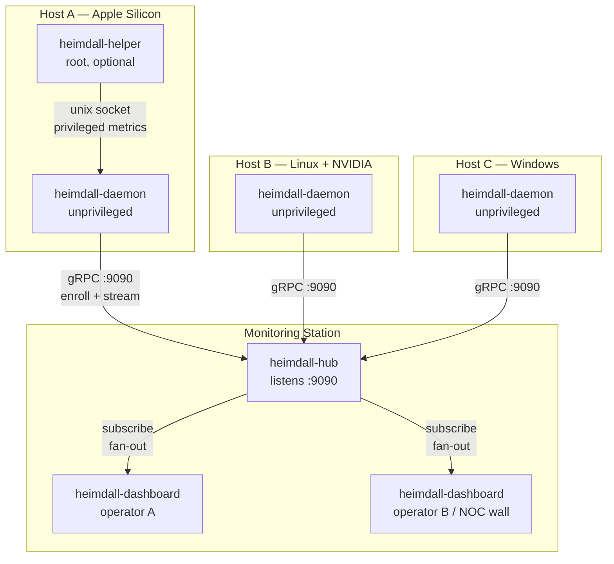
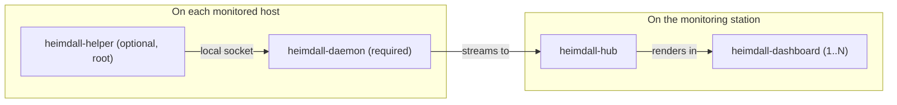
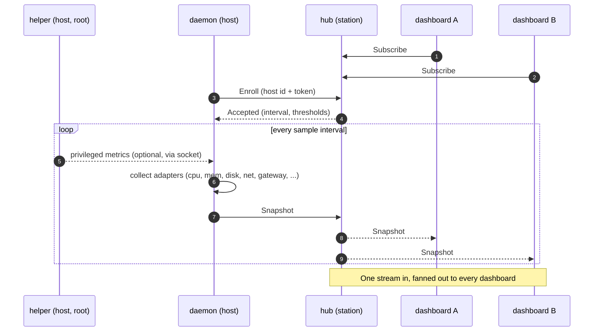
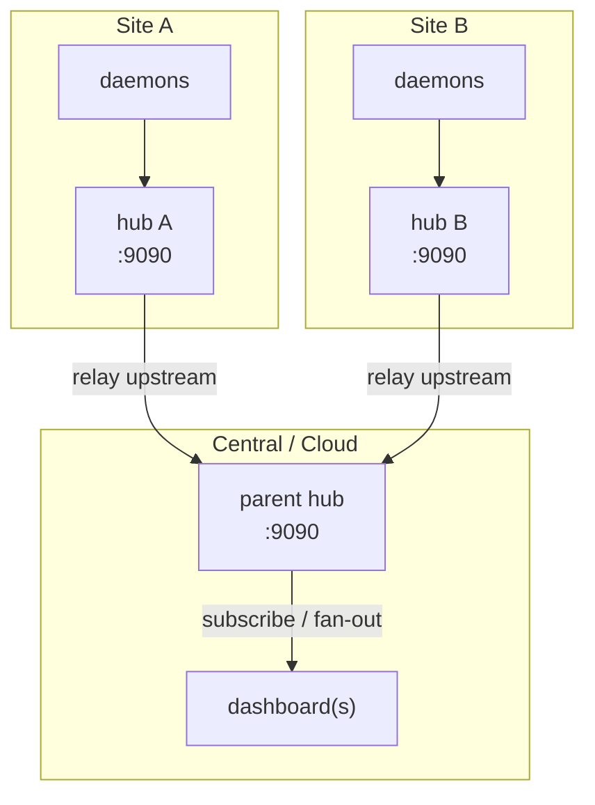

# Heimdall — Deployment & Operations Guide

How to run Heimdall: what goes on the **monitoring station**, what goes on each
**host**, and how metrics stream to **one or more dashboards**.

## The four binaries

| Binary | Runs on | Privilege | Responsibility |
|---|---|---|---|
| `heimdall-hub` | monitoring station | normal user | Receives metric streams from daemons and fans them out to dashboards. The one process every other piece connects to. |
| `heimdall-dashboard` | monitoring station (any number) | normal user | Pure presentation. Subscribes to a hub and renders the fleet. Collects nothing itself. |
| `heimdall-daemon` | every monitored host | **unprivileged** | Collects this host's metrics (CPU, per-core, memory, disk, temperature, network throughput, internet + per-NIC gateway latency, uptime, GPU/power where available) and streams them to the hub. |
| `heimdall-helper` | a monitored host (optional) | **root** | Exposes privileged metrics (full thermal, CPU/ANE power, extra GPU detail) to the local unprivileged daemon over a unix socket, so the daemon never runs as root. |

Data flow: **daemon → hub → dashboard(s)**. The helper is a local sidecar to the
daemon: **helper → daemon** over a unix socket on the same host.

## Topology



The hub fans the same live data out to **every** subscribed dashboard, so you can
run as many dashboards as you like (a laptop, a NOC wall display, a teammate's
terminal) against one hub.

## What runs where — at a glance



## Quick start

### 1. On the monitoring station

```sh
# Receive metrics from hosts (listens on :9090)
./bin/heimdall-hub &

# Watch the fleet (defaults to localhost:9090)
./bin/heimdall-dashboard
```

Run `heimdall-dashboard` again — on the same or another machine — to open a second
view of the same fleet:

```sh
# from a teammate's laptop, pointed at the station
./bin/heimdall-dashboard --hub 192.168.1.50:9090
```

### 2. On each host you want to monitor

```sh
# Replace 192.168.1.50 with the monitoring station's IP
./bin/heimdall-daemon --hub 192.168.1.50:9090 --name "$(hostname)"
```

Each daemon appears as its own row in every dashboard, keyed by `--name`.

### 3. (Optional) Privileged metrics on a host

Only if a metric shows the needs-helper affordance (`⚿`) and you want it without
running the daemon as root:

```sh
sudo ./bin/heimdall-helper &     # serves privileged metrics on a local socket
# the daemon auto-detects the socket — no daemon flag needed
```

### Monitor just your own machine

The station can also be a monitored host — run all three locally:

```sh
./bin/heimdall-hub &
./bin/heimdall-daemon --hub localhost:9090 --name "$(hostname)" &
./bin/heimdall-dashboard
```

## End-to-end sequence

How a host enrolls, streams, and reaches multiple dashboards:



## Do I need the helper?

Usually **no** — start with just the daemon and add the helper only if a metric
you want shows `⚿`.

| Platform | GPU / power without helper? | Helper adds |
|---|---|---|
| Apple Silicon (macOS) | Yes — GPU power + utilisation via IOReport, no root | Full thermal, CPU/ANE power (where the SoC exposes it) |
| Linux + NVIDIA | Yes — `nvidia-smi` is readable unprivileged | Vendor-specific extras |
| Other | Depends on the platform tool | Whatever needs root |

> Note: some Apple Silicon SoCs do not expose a CPU package-power counter at all
> (neither IOReport nor `powermetrics`); CPU power reads as unavailable there.

## Networking & ports

- The hub listens on **`:9090`** by default (`--listen` to change). Open this port
  on the monitoring station so hosts can reach it.
- Daemons make **outbound** connections to the hub; dashboards make outbound
  connections to the hub. No inbound ports are needed on the hosts.
- The helper uses a **local unix socket** only — nothing is exposed on the network.

## Security (production)

Unauthenticated plaintext is the default for local development. For any shared or
networked deployment, require a token and enable TLS on all three:

```sh
# Monitoring station
export HEIMDALL_TOKEN=$(openssl rand -hex 16)
make dev-certs            # self-signed cert -> certs/ (dev only; use a real CA in prod)
./bin/heimdall-hub --tls-cert certs/hub.crt --tls-key certs/hub.key --token "$HEIMDALL_TOKEN" &
./bin/heimdall-dashboard --tls --tls-ca certs/hub.crt --token "$HEIMDALL_TOKEN"

# Each host
./bin/heimdall-daemon --hub station:9090 --tls --tls-ca certs/hub.crt --token "$HEIMDALL_TOKEN"
```

A daemon presenting a missing or invalid token is rejected at enrollment and never
registered. See the README "Secure mode" section for details.

## Advanced: multiple sites (federation / Bifröst)

For multiple sites or networks, a site-local hub can relay its hosts to a parent
hub. A central dashboard then sees every host across sites, and loop prevention
keeps cross-linked hubs safe.



```sh
# Parent (central) hub
./bin/heimdall-hub --id central --listen :9090 &

# Each site hub relays its hosts upstream to the parent
./bin/heimdall-hub --id site-a --listen :9090 --upstream central-host:9090 &

# Dashboards subscribe to the parent to see every site
./bin/heimdall-dashboard --hub central-host:9090
```

## Dashboard keys

`↑/↓` select host · `⏎` host detail · `r` refresh · `?` help · `q` quit.

## Troubleshooting

| Symptom | Likely cause | Fix |
|---|---|---|
| Dashboard shows no hosts | No hub reachable, or no daemons connected | Confirm the hub is running and `--hub` points at it; check the station firewall allows `:9090`. |
| A host never appears | Daemon can't reach the hub | Verify the station IP/port from the host: `nc -vz station 9090`. |
| Metrics show `⚿` (needs-helper) | Privileged metric without a source | Run `sudo heimdall-helper` on that host, or ignore if you don't need it. |
| `Unauthenticated` on the daemon | Token mismatch | Use the same `--token` / `HEIMDALL_TOKEN` on hub, daemon, and dashboard. |
| GPU/CPU power blank on macOS | SoC exposes no counter | Expected on some chips; not a misconfiguration. |
