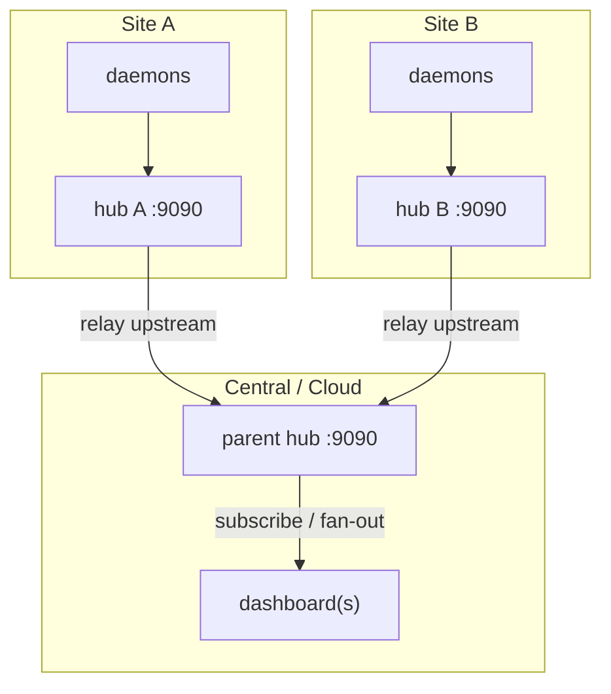
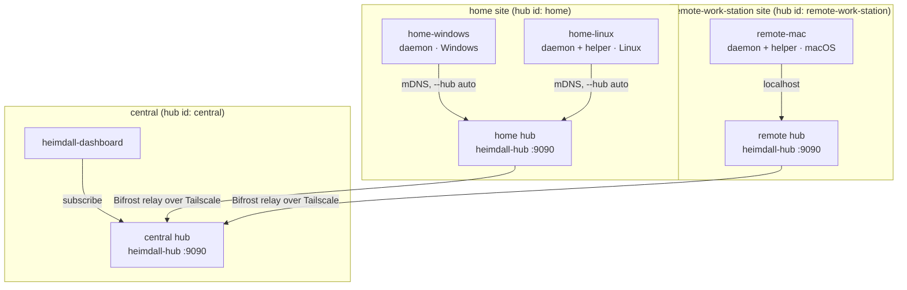
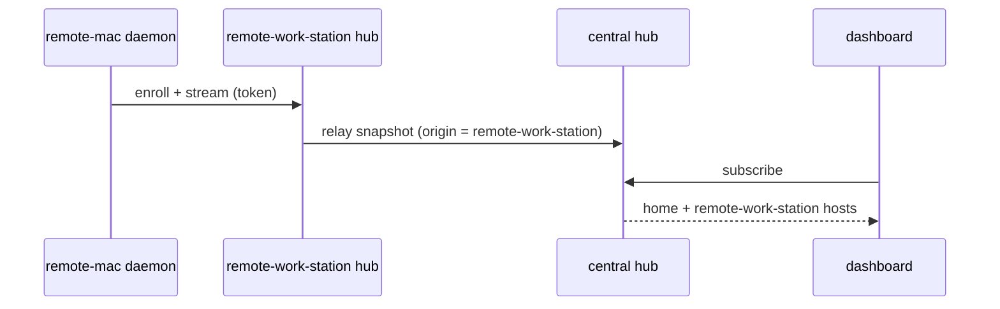

# Federation (Bifröst) — Multiple Sites

A site-local hub can relay its hosts **upstream** to a parent hub. A central
dashboard then sees every host across every site, while each site keeps a local
hub for its own daemons.

Named after Bifröst, the bridge between realms.

## Topology



## How it works

- Relay is **one-directional**: child → parent.
- Each hub appends its `--id` to a snapshot's path and **drops any envelope that
  already contains its own id**, so cross-linked hubs never loop.
- Hosts resume by stable HostID across reconnects — no duplicates.

## Setup

```sh
# Parent (central) hub
./bin/heimdall-hub --id central --listen :9090 &

# Each site hub relays its hosts upstream to the parent
./bin/heimdall-hub --id site-a --listen :9090 --upstream central-host:9090 &

# Daemons feed their local site hub as usual
./bin/heimdall-daemon --hub site-a-host:9090 --name web-01 &

# Dashboards subscribe to the parent to see every site
./bin/heimdall-dashboard --hub central-host:9090
```

## Local demo (one machine, two hubs)

```sh
./bin/heimdall-hub --id parent --listen :9090 &
./bin/heimdall-hub --id edge-1 --listen :9091 --upstream localhost:9090 &
./bin/heimdall-daemon --hub localhost:9091 --name edge-host &
./bin/heimdall-dashboard --hub localhost:9090   # sees edge-host via the parent
```

## Securing the cross-hub link

The relay link is just another authenticated client. Use the `--upstream-` flags,
which mirror the daemon's client flags:

| Flag | Meaning |
|---|---|
| `--upstream <addr>` | parent hub to relay to |
| `--upstream-token` | enrollment token for the parent (env `HEIMDALL_UPSTREAM_TOKEN`) |
| `--upstream-tls` | relay over TLS |
| `--upstream-tls-ca` | PEM CA bundle to trust for the parent |
| `--upstream-tls-server-name` | override the verified server name |
| `--upstream-tls-insecure` | dev only — skip verification |
| `--relay-interval` | how often to relay hosts upstream (default 2s) |

The child re-authenticates to the parent on every reconnect.

## Tuning

`--relay-interval` trades freshness against bandwidth on the cross-site link. The
parent's own `--stale-after` / `--offline-after` decide how quickly a relayed host
is marked stale or offline if a site goes dark.

## Real local example: two sites over Tailscale

Four machines on one tailnet, in two sites, federated to a central hub that the
dashboard connects to. Tailscale gives us the encrypted overlay and device ACLs;
Heimdall keeps an **enrollment token** as the app-level gate on top. Configuring
Tailscale is out of scope here — assume MagicDNS resolves the names below across
the tailnet.

| MagicDNS name | OS | Runs | Site |
|---|---|---|---|
| `central` | Linux | central hub + dashboard | — |
| `home-linux` | Linux | home hub + daemon + helper | `home` |
| `home-windows` | Windows | daemon | `home` |
| `remote-mac` | macOS | site hub + daemon + helper | `remote-work-station` |

(Short MagicDNS names work across the tailnet; the full form is
`central.tailnet-acme.ts.net` and so on.)



Use the **same enrollment token on every node**; replace the placeholder below
with a real secret.

**`central` (Linux) — the aggregating hub + the dashboard:**

```bash
# central hub: receives both sites, no upstream of its own
heimdall-hub --id central --listen 0.0.0.0:9090 \
  --token "tnet-heimdall-shared" &

# the operator's dashboard subscribes to the local central hub and sees everything
heimdall-dashboard --hub localhost:9090 --token "tnet-heimdall-shared"
```

**`home-linux` (Linux) — the `home` site hub, plus a daemon and the helper:**

```bash
# home site hub: discoverable on the home LAN, relays upstream to central
heimdall-hub --id home --listen 0.0.0.0:9090 \
  --discoverable \
  --tags site=home \
  --upstream central:9090 \
  --upstream-token "tnet-heimdall-shared" \
  --token "tnet-heimdall-shared" &

# privileged helper: RAPL package power + hwmon temperatures (needs root for /sys)
sudo heimdall-helper &

# this host's daemon finds the home hub on the LAN via mDNS
heimdall-daemon --hub auto \
  --name home-linux \
  --tags os=linux,role=server \
  --token "tnet-heimdall-shared" &
```

**`home-windows` (Windows) — daemon only (no privileged helper on Windows yet):**

```bash
# discovers the home hub on the same LAN via mDNS
heimdall-daemon --hub auto \
  --name home-windows \
  --tags os=windows,role=desktop \
  --token "tnet-heimdall-shared"
```

**`remote-mac` (macOS) — its own `remote-work-station` site hub, daemon, and helper:**

```bash
# this site's hub relays upstream to central over the tailnet
heimdall-hub --id remote-work-station --listen 0.0.0.0:9090 \
  --tags site=remote-work-station \
  --upstream central:9090 \
  --upstream-token "tnet-heimdall-shared" \
  --token "tnet-heimdall-shared" &

# privileged helper: full thermal + CPU/ANE power via powermetrics (needs root)
sudo heimdall-helper &

# the mac's daemon talks to its own local hub
heimdall-daemon --hub localhost:9090 \
  --name remote-mac \
  --tags os=macos,role=workstation \
  --token "tnet-heimdall-shared" &
```

### Discovery across the tailnet

- **Within a site's LAN**, mDNS works: the `home` hub is `--discoverable`, so
  `home-linux` and `home-windows` daemons use `--hub auto` and need no address.
- **Across the Tailscale overlay**, mDNS does not carry (no multicast). The two
  site-to-central relays and the dashboard use the MagicDNS name directly
  (`--upstream central:9090`). If you prefer the discover flag with an explicit
  hop, `--hub auto --discover-seed central:9090` does the same.

### What flows where



At the central dashboard every host carries its origin `hub` label (`home`,
`remote-work-station`) and its site hub's inherited `site=` tag, so you can group
or filter the whole fleet by site — see
[Yggdrasil grouping](../glossary.md) and the
[Mímir export](09-metrics-export.md).

### Why this is enough authentication

- Tailscale already encrypts every link (WireGuard) and restricts which devices
  can reach `:9090` via its ACLs, so you can run Heimdall in plaintext over the
  tailnet and skip Heimdall's own TLS — the tailnet **is** the secure channel.
- The enrollment token is the minimum app-level gate: a device that joins the
  tailnet still cannot enroll a daemon or subscribe a dashboard without it.
- Only the hubs listen (`:9090`, reachable over the tailnet). Daemons and
  dashboards dial out and need no inbound ports.

## Tags and the `hub` label across the tree

A hub's `--tags` (Realms) are inherited by **every** host it relays, so a site
hub can stamp a common `region=`/`tier=` onto all of its hosts at once. A host's
own tag of the same key still wins over the hub's.

Each host also carries its **origin hub** as an authoritative `hub` label, which
the relay stamps on the way up. The central dashboard — and the
[Mímir metrics export](09-metrics-export.md) on the parent — can therefore group
or filter the whole federated fleet by `hub`.

## Background

See [ADR 0006 — Dashboard federation via pub/sub relay](../architecture/0006-dashboard-federation-via-pubsub-relay.md).

## Next steps

- Lock down each link → [Secure Deployment](03-secure-deployment.md)
- Full flag reference → [Configuration](../configuration.md)
