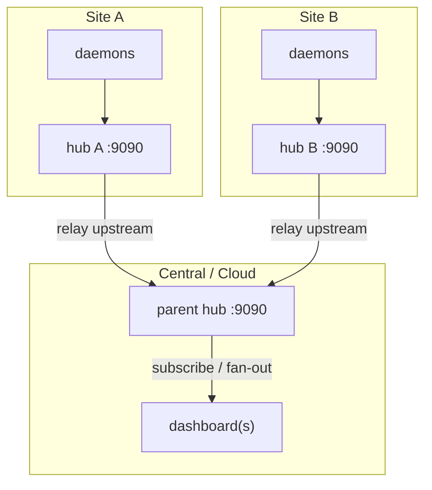

# Federation (Bifröst) — Multiple Sites

A site-local hub can relay its hosts **upstream** to a parent hub. A central
dashboard then sees every host across every site, while each site keeps a local
hub for its own daemons.

Named after Bifröst, the bridge between realms.

## Topology



## How it works

- Relay is **one-directional**: child → parent.
- Each hub appends its `--id` to a snapshot's path and **drops any envelope that
  already contains its own id**, so cross-linked hubs never loop.
- Hosts resume by stable HostID across reconnects — no duplicates.

## Setup

```sh
# Parent (central) hub
./bin/heimdall-hub --id central --listen :9090 &

# Each site hub relays its hosts upstream to the parent
./bin/heimdall-hub --id site-a --listen :9090 --upstream central-host:9090 &

# Daemons feed their local site hub as usual
./bin/heimdall-daemon --hub site-a-host:9090 --name web-01 &

# Dashboards subscribe to the parent to see every site
./bin/heimdall-dashboard --hub central-host:9090
```

## Local demo (one machine, two hubs)

```sh
./bin/heimdall-hub --id parent --listen :9090 &
./bin/heimdall-hub --id edge-1 --listen :9091 --upstream localhost:9090 &
./bin/heimdall-daemon --hub localhost:9091 --name edge-host &
./bin/heimdall-dashboard --hub localhost:9090   # sees edge-host via the parent
```

## Securing the cross-hub link

The relay link is just another authenticated client. Use the `--upstream-` flags,
which mirror the daemon's client flags:

| Flag | Meaning |
|---|---|
| `--upstream <addr>` | parent hub to relay to |
| `--upstream-token` | enrollment token for the parent (env `HEIMDALL_UPSTREAM_TOKEN`) |
| `--upstream-tls` | relay over TLS |
| `--upstream-tls-ca` | PEM CA bundle to trust for the parent |
| `--upstream-tls-server-name` | override the verified server name |
| `--upstream-tls-insecure` | dev only — skip verification |
| `--relay-interval` | how often to relay hosts upstream (default 2s) |

The child re-authenticates to the parent on every reconnect.

## Tuning

`--relay-interval` trades freshness against bandwidth on the cross-site link. The
parent's own `--stale-after` / `--offline-after` decide how quickly a relayed host
is marked stale or offline if a site goes dark.

## Tags and the `hub` label across the tree

A hub's `--tags` (Realms) are inherited by **every** host it relays, so a site
hub can stamp a common `region=`/`tier=` onto all of its hosts at once. A host's
own tag of the same key still wins over the hub's.

Each host also carries its **origin hub** as an authoritative `hub` label, which
the relay stamps on the way up. The central dashboard — and the
[Mímir metrics export](09-metrics-export.md) on the parent — can therefore group
or filter the whole federated fleet by `hub`.

## Background

See [ADR 0006 — Dashboard federation via pub/sub relay](../architecture/0006-dashboard-federation-via-pubsub-relay.md).

## Next steps

- Lock down each link → [Secure Deployment](03-secure-deployment.md)
- Full flag reference → [Configuration](../configuration.md)
