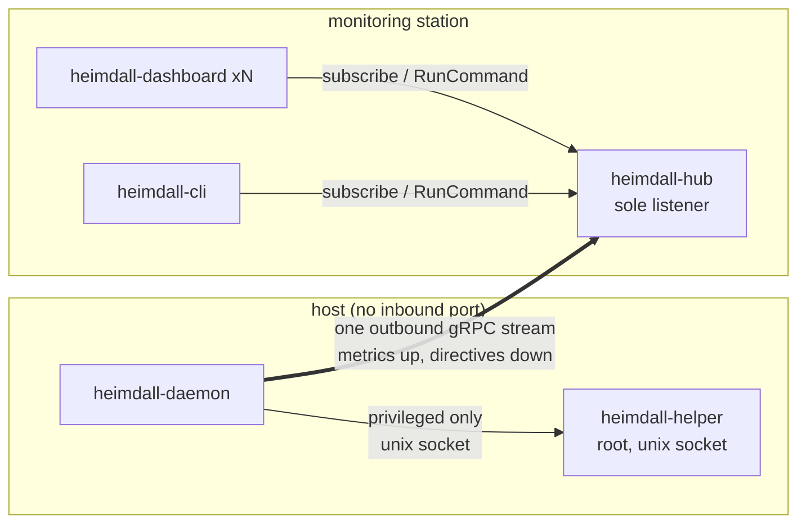
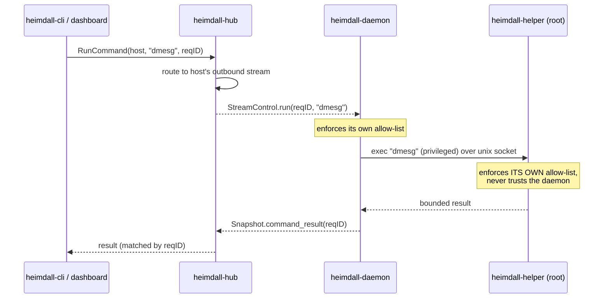
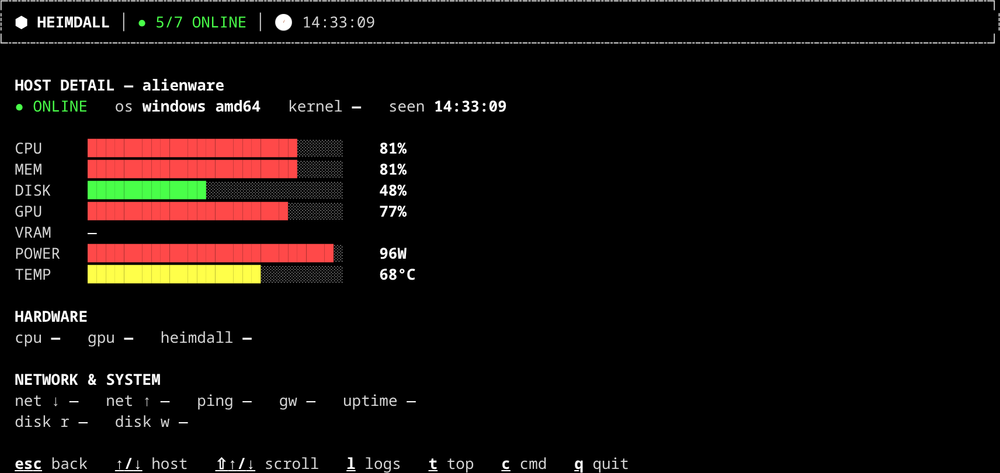

<!--
SPDX-License-Identifier: AGPL-3.0-or-later
Copyright (C) 2026 Kinn Coelho Juliao <kinncj@gmail.com>
-->

# Heimdall v2.0.0 — the *everything socket* release

> **Released:** 2026-06-29 · **Type:** MAJOR (breaking) · **Codename:** everything socket

v2 makes Heimdall **interactive** without compromising the security model that made
v1 safe to point at a fleet: **daemons still never listen.** Every new capability —
on-demand commands, in-dashboard logs, a live process view, the JSON CLI — rides
the *single outbound stream* the daemon already holds to the hub. No host gains an
inbound port. The hub remains the sole listener and mediates every directive.

If v1 let Heimdall **see** (metrics) and **hear** (logs), v2 lets it **act** — on
demand, allow-listed, audited, and least-privilege.

<p align="center">
  
</p>

---

## Table of contents

- [Highlights](#highlights)
- [The socket model](#the-socket-model-how-v2-works)
- [In-dashboard observability](#in-dashboard-observability)
- [On-demand commands](#on-demand-commands)
- [`heimdall-cli`](#heimdall-cli)
- [Real-time online/offline](#real-time-onlineoffline)
- [Security model](#security-model)
- [Breaking changes](#breaking-changes)
- [Upgrade guide](#upgrade-guide)
- [Configuration reference](#configuration-reference)
- [Verify it yourself](#verify-it-yourself)
- [Documentation map](#documentation-map)

---

## Highlights

| Capability | What it is | Where |
|---|---|---|
| **Hub-mediated socket transport** | The daemon's outbound metric stream is reused as a bidirectional control channel. The hub pushes directives *down* to a daemon that never listens. | [ADR 0018](../architecture/0018-v2-persistent-socket-mediation.md) |
| **In-dashboard logs** (`l`) | Stream a host's log sources live, with `/` substring search, right in the TUI. | [Guide 07](../guides/07-log-streaming.md) |
| **Live process view** (`t`) | A refreshing process table, sortable (`s`), CPU-desc by default; the choice persists. | [ADR 0019](../architecture/0019-v2-log-search-and-top-sorting.md) |
| **On-demand commands** (`c` / CLI) | Read-only, allow-listed diagnostics run via the hub and routed down the daemon's stream; privileged ones delegate to the root helper. | [Guide 06](../guides/06-control-plane.md) |
| **`heimdall-cli`** | A machine- & AI-friendly JSON client: `fleet`, `hosts`, `host`, `top`, `logs`, `run`. | [Guide 11](../guides/11-hub-cli.md) |
| **Zeroconf multi-hub** | When several hubs are advertised, the dashboard offers a picker and the CLI reports them. | [ADR 0009](../architecture/0009-ratatoskr-zeroconf-service-discovery.md) |
| **Real-time online→offline** | The hub flips a host offline the instant its stream ends, not on a timeout. | [below](#real-time-onlineoffline) |
| **Manpages + agent guide** | `roff` manpages per binary, plus a programmatic guide with copy-paste AGENT/SKILL/COMMAND files. | [Guide 11](../guides/11-hub-cli.md) |

---

## The socket model: how v2 works

The daemon opens **one** gRPC stream to the hub and holds it. v1 used it to *push*
metrics. v2 reuses the **same** stream, bidirectionally, as a control channel —
the hub sends `StreamControl` directives down it, the daemon answers on its
snapshots. Nothing else opens; no daemon ever listens.



A command is **demand-driven** and correlated end-to-end by request id:



Implemented in three phases, all shipped in v2.0.0:

- **Phase 1 — demand-driven push.** The hub opens a host's log/process window only
  while a dashboard or CLI is subscribed, and closes it on the last unsubscribe.
- **Phase 2 — on-demand commands (unprivileged).** Allow-listed, read-only commands
  run as the daemon's own user.
- **Phase 2b — helper-delegated privileged commands.** Commands needing root are
  delegated to the local helper over a unix socket; the helper enforces its **own**
  allow-list.

---

## In-dashboard observability

From a host's detail view, `l` opens its **logs** (with `/` search) and `t` opens a
live, sortable **process table**. `esc` is the universal back button. The
affordances appear only for hosts that advertise the capability.

<p align="center">
  
</p>

These ride additive `Snapshot` fields, pushed only while a dashboard is watching,
and buffered per host on the hub. **Nothing connects to a daemon.**

---

## On-demand commands

Read-only, allow-listed diagnostics, opt-in per daemon (`--allow-commands`):

| Key | Privilege | Runs |
|---|---|---|
| `process.list` | unprivileged | process table |
| `disk.df` | unprivileged | filesystem usage |
| `uptime` | unprivileged | uptime/load |
| `os.info` | unprivileged | OS / kernel string |
| `dir.list <dir>` | unprivileged | a bounded directory (Unix roots: `/var/log`, `/tmp`) |
| `dmesg` | **privileged** (helper) | kernel ring buffer |
| `journal.tail` | **privileged** (helper) | recent journal lines |

From the dashboard press `c`; from a script or agent use `heimdall-cli run`:

```sh
heimdall-cli run web-01 disk.df | jq -r .stdout
heimdall-cli run gpu-box dmesg          # delegated to the root helper on that host
```

Output is **bounded at the source** (64 KiB/stream) and nothing arbitrary is ever
executed — the daemon and the helper each enforce their own allow-list.

---

## `heimdall-cli`

A first-class binary that speaks JSON for scripts, CI/CD, and AI harnesses:

```sh
heimdall-cli hosts | jq '.[] | select(.state=="offline").id'
heimdall-cli top dgx-spark
heimdall-cli logs web-01 app
heimdall-cli --hub auto fleet        # discover the hub over mDNS
```

`--hub auto` discovers the hub via zeroconf; when more than one is present it
reports them and asks you to pick with `--hub <addr>`. See [Guide 11](../guides/11-hub-cli.md)
for the bash-parsing recipes, a CI/CD GitHub Action that waits for a host to come
online, Datadog log piping, and copy-paste AGENT/SKILL/COMMAND files.

---

## Real-time online/offline

The hub holds the **server** end of every daemon's stream, so it learns of a
disconnect the instant `Recv()` returns — a clean shutdown (`CloseSend` on SIGTERM)
or an abrupt socket drop when the process dies. v2 acts on it: the host flips
**offline immediately** and the change is pushed to dashboards, instead of waiting
out the freshness window.

The timeout path is **retained as the fallback** for disconnects the hub can't
observe (SIGKILL with a frozen network, power loss, partition). Additive wire field
`Snapshot.disconnected`; old subscribers ignore it and degrade to the timeout.

---

## Security model

v2 adds *action* without widening the attack surface:

- **Daemons never listen.** No inbound port, on any host. Proven by an automated
  audit — see [Verify it yourself](#verify-it-yourself).
- **The hub is the sole listener** and mediates every directive.
- **Two independent allow-lists.** The daemon refuses anything off its list; the
  helper refuses anything off *its* list and never trusts the daemon.
- **Least privilege.** The daemon runs unprivileged; only the helper can run as
  root, and only for explicitly privileged, allow-listed, bounded commands.
- **Tightened helper socket.** Now that the helper runs commands, its unix socket
  is owner+group (`0660`), not world-writable — closing a local-privilege-escalation
  vector.

---

## Breaking changes

v2.0.0 marks the **completed architectural shift to outbound-only daemons**. The
breaking part of that shift — the daemon ceasing to act as a server — already
shipped in **v1.6.0**. v2.0.0 itself is **additive over v1.6.0**: it restores
on-demand interaction over the new hub-mediated socket model. The MAJOR version
names the finished story, not a fresh break.

**If you are upgrading from v1.5.x or earlier**, these were removed along the way
(v1.6.0) and have no v1-style replacement — the dashboard and CLI now reach
everything *through the hub*:

| Removed (v1.6.0) | Replacement (v2.0.0) |
|---|---|
| daemon `--control-listen` / `--control-token` / `--control-tls-*` | `--allow-commands` (hub-routed); `--process-interval`, `--log-source` to push |
| dashboard `--control` / `--run` / `--tail` | `c` / `t` / `l` in the TUI, or `heimdall-cli run` / `top` / `logs` |

`--log-source` is **kept**, but configures what the daemon **pushes** rather than a
served stream.

**Wire compatibility:** additive only. v2 adds `Snapshot` fields (`processes`,
`processes_at`, `log_lines`, `command_result`, `disconnected`) and `StreamControl`
directives. An old daemon and a new hub (or vice-versa) interoperate; there is no
lockstep upgrade for metrics.

---

## Upgrade guide

1. **Build/install v2** on the station and hosts (`make build-tui`, or the
   prebuilt binaries / AUR package).
2. **Remove the deleted flags** from any daemon/dashboard service units or scripts
   (`--control-listen`, `--control`, `--run`, `--tail`, …). The daemon will refuse
   unknown flags.
3. **Opt in** to what each host should expose:
   - logs → `--log-source app=/var/log/app.log`
   - process view → `--process-interval 5s`
   - commands → `--allow-commands` (and run `heimdall-helper` as root for privileged ones)
4. **Roll the hub first, then daemons.** Additive wire fields mean either order
   works, but a v2 hub is needed to drive the new directives.

No data migration is required. The hub's durable sink (Mímir, ADR 0016) is
unchanged.

---

## Configuration reference

New/changed flags (all persistable to each binary's config — see
[configuration](../configuration.md)):

**`heimdall-daemon`**

| Flag | Default | Purpose |
|---|---|---|
| `--allow-commands` | off | advertise `_cmd` and run allow-listed read-only commands |
| `--process-interval <dur>` | off | collect + push a process table every interval (advertises `_proc`) |
| `--log-source <alias=path>` | — | tail a log file and push it (advertises `_logs`); repeatable |

**`heimdall-dashboard`**

| Flag | Default | Purpose |
|---|---|---|
| `--hub auto` | — | discover the hub over mDNS; pick among several if found |
| `--mode dark\|light` | `dark` | theme; persisted on change |
| `--top-sort cpu\|mem\|pid\|command` | `cpu` | default sort for the `t` modal; persisted on change |

**`heimdall-cli`** — `--hub addr|auto`, `--token`, `--tls…`, `--wait <dur>`;
commands: `fleet`, `hosts`, `host <id>`, `top <id>`, `logs <id> [source]`,
`run <id> <cmd> [args]`.

---

## Verify it yourself

v2 ships an automated proof that the socket model holds — that it really uses
**one** socket and **nothing else**:

```sh
# Acceptance suite: daemons listen on nothing; commands open no new socket.
behave tests/features/socket-hygiene.feature

# Live audit on a real host (pgrep + ss):
scripts/verify-sockets.sh
```

`verify-sockets.sh` exits non-zero on any violation (a daemon listening, or a stray
connection). On a healthy fleet it reports *“daemons outbound-only, hub the sole
network listener.”*

---

## Documentation map

- **Guides:** [Control plane](../guides/06-control-plane.md) ·
  [Log streaming](../guides/07-log-streaming.md) · [`heimdall-cli`](../guides/11-hub-cli.md)
- **ADRs:** [0018 — socket mediation](../architecture/0018-v2-persistent-socket-mediation.md) ·
  [0019 — log search & top sorting](../architecture/0019-v2-log-search-and-top-sorting.md) ·
  [0017 — in-dashboard observability](../architecture/0017-heimdallr-sight-in-dashboard-observability.md)
- **Reference:** [Configuration](../configuration.md) · [Deployment](../deployment.md) ·
  [CHANGELOG](../../CHANGELOG.md)
