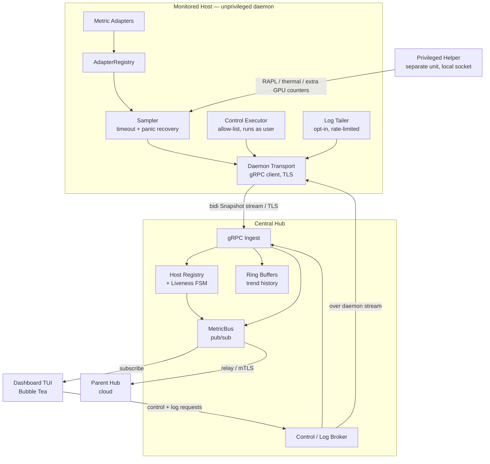
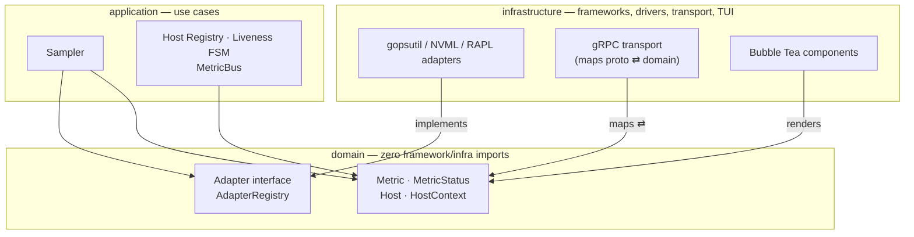
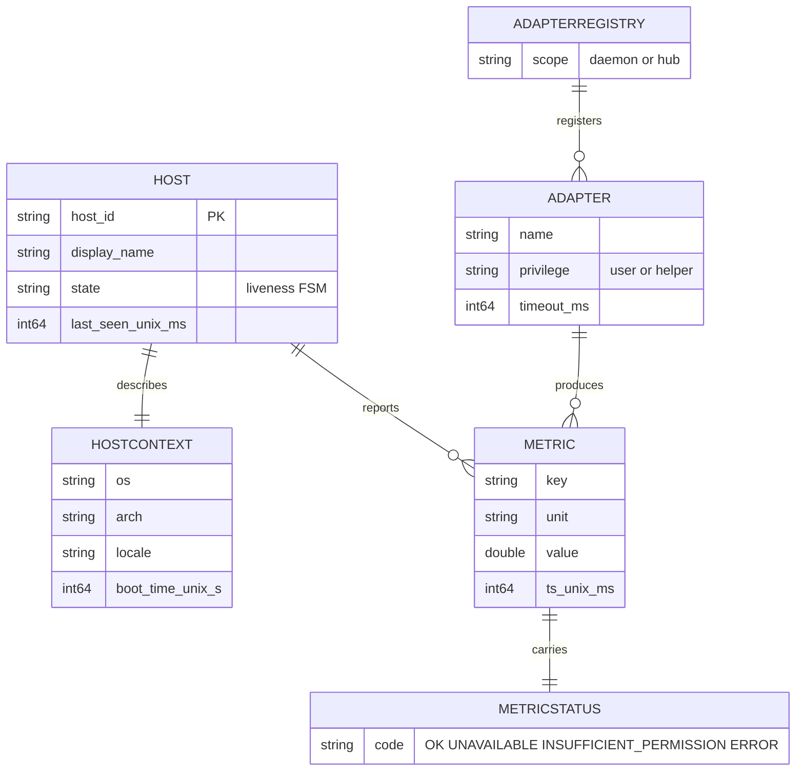
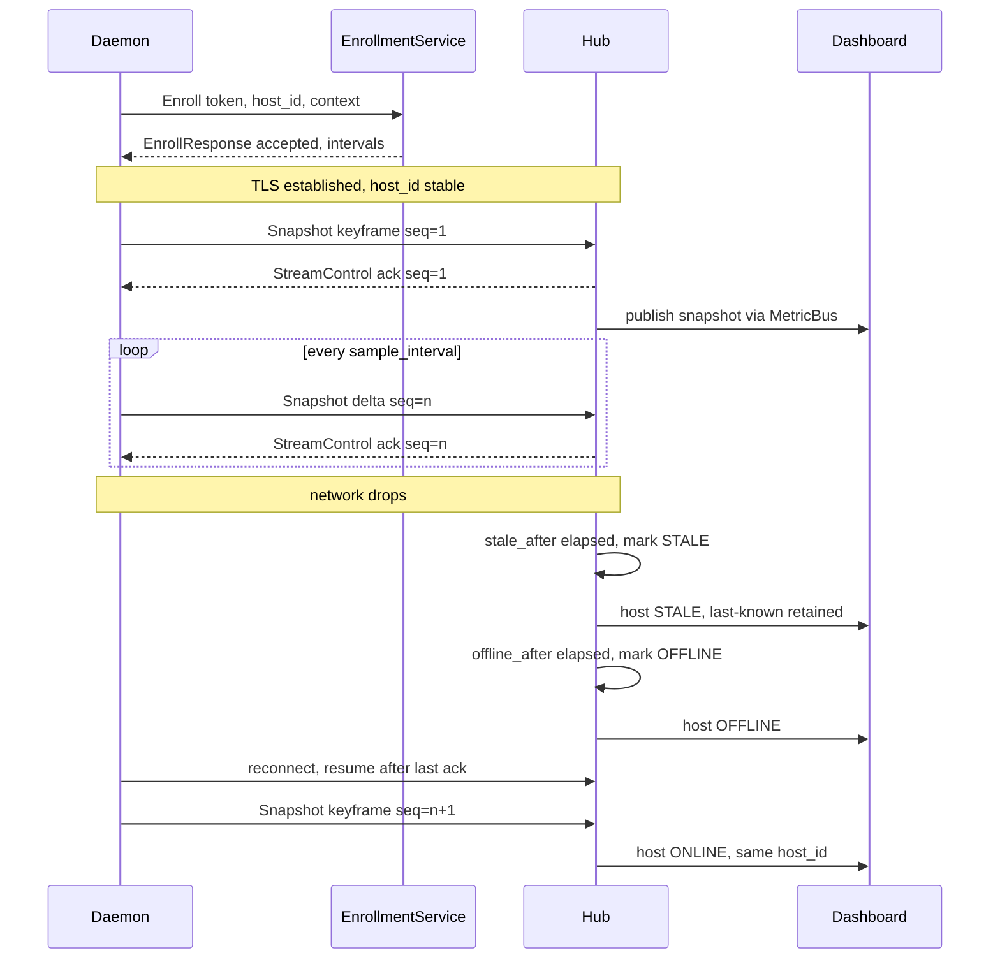
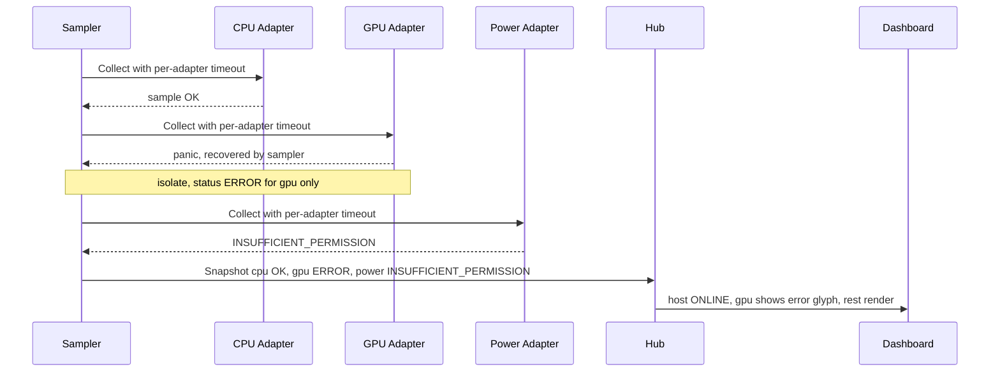
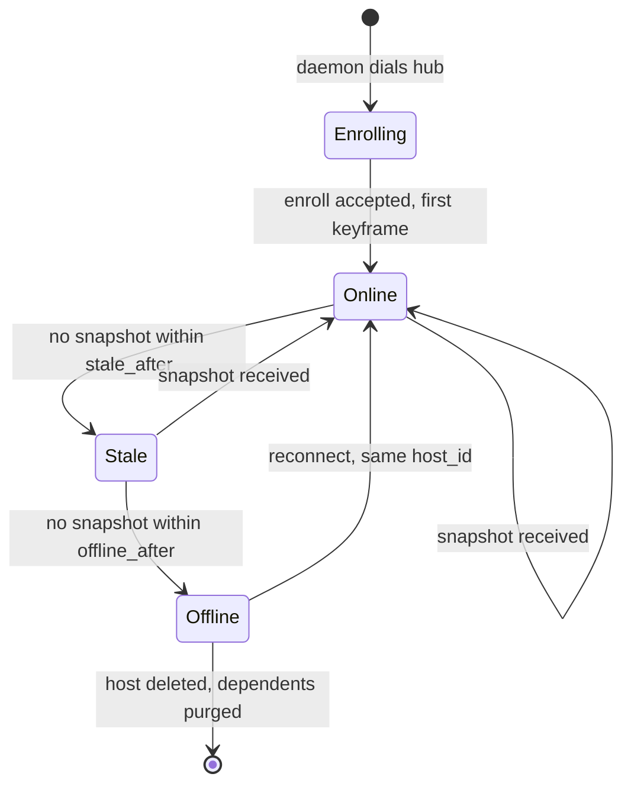
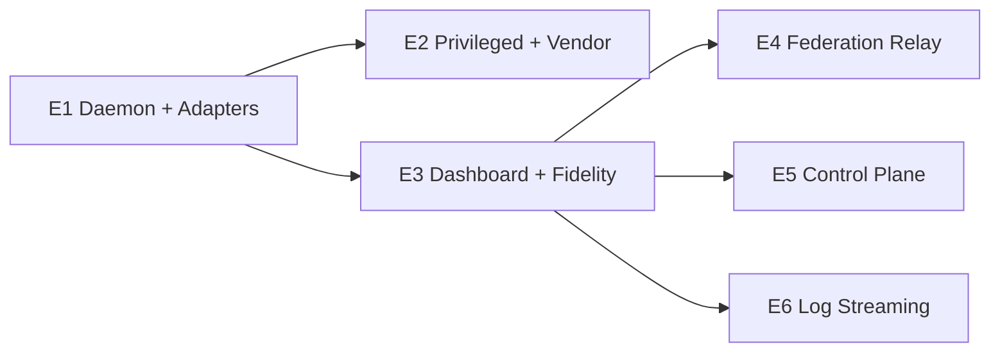

# Heimdall — System Architecture

> Remote hardware monitoring. "The watcher who sees and hears everything."
> Sees = metrics + TUI. Hears = opt-in logs.

| | |
|---|---|
| **Status** | Proposed (ARCHITECT artifact set) |
| **Module** | single Go module `heimdall` (bare path, re-pointable to `github.com/<owner>/heimdall`) |
| **Binaries** | `heimdall-daemon`, `heimdall-helper`, `heimdall-hub`, `heimdall-dashboard` |
| **Design target** | `tui` (Bubble Tea + Lip Gloss + Bubbles) |
| **Contract** | [`common/proto/monitoring/v1/monitoring.proto`](../../../common/proto/monitoring/v1/monitoring.proto) |

---

## 1. Context

Operators run a heterogeneous fleet — workstation, NVIDIA DGX Spark, AMD HP Strix
Halo, Apple Mac mini, Raspberry Pi, Alienware — across Windows, macOS, and Linux
on amd64 and arm64. They need one terminal dashboard that shows every machine's
hardware health in real time (btop/mactop-class), tolerates flaky/low-bandwidth
links, and never lies about freshness when a host goes quiet.

Existing tools are per-host (btop, mactop) or heavyweight (Prometheus + Grafana +
exporters + a TSDB). Heimdall targets the gap: a lightweight, cross-compiled,
streaming fleet monitor with a first-class terminal UX, an unprivileged-by-default
security posture, and optional federation from a local hub up to a cloud hub.

This document is the staff-level system design. It is binding on downstream PLAN,
INFRA, and IMPLEMENT phases.

## 2. Goals / Non-Goals

**Goals**

- One static binary per role, cross-compiled for Windows/macOS/Linux × amd64/arm64.
- Streaming metrics over a low-bandwidth, reconnect-tolerant gRPC channel.
- Extensible metric collection via a SOLID **Adapter** contract; new metrics add
  without modifying existing adapters (OCP).
- **Failure isolation**: one failing metric never drops the host or other metrics.
- Unprivileged daemon by default; an **optional privileged helper** supplies
  power/RAPL/full-thermal/extra-GPU counters over a local socket.
- Honest liveness: `enrolling → online → stale → offline → online`, last-known
  values retained with timestamps.
- Central hub with in-memory ring buffers (trend history) and a pub/sub MetricBus;
  dashboards and a federation relay are subscribers.
- Read-only, allow-listed, unprivileged remote control plane. No sudo, no shell.
- Opt-in, rate-limited log tailing on a separate stream.

**Non-Goals (v1)**

- No time-series database. Trend history is bounded in-memory ring buffers.
- No write/remediation control actions. The control plane is read-only.
- No alerting/paging engine, no long-term retention, no metric query language.
- No web UI. The only UI is the terminal dashboard.
- No always-on log shipping. Logs are opt-in and ephemeral.
- No auto-remediation, orchestration, or config push to hosts.

## 3. Scope — six epics

| Epic | Theme | Stories |
|---|---|---|
| **E1** | Daemon + adapter foundation | `extensible-solid-metric-adapter-architec-0003`, `cross-platform-metrics-daemon-enrollment-0001`, `host-context-locale-uptime-os-0008`, `network-reachability-and-ping-0007` |
| **E2** | Privileged + vendor metrics | `optional-privileged-metrics-helper-0005`, `gpu-and-power-metric-adapters-0006` |
| **E3** | Dashboard + visual fidelity | `real-time-centralized-go-tui-dashboard-0002`, `high-fidelity-terminal-visual-experience-0004` |
| **E4** | Federation relay | `centralized-dashboard-federation-relay-0009` |
| **E5** | Control plane | `unprivileged-terminal-control-plane-0010` |
| **E6** | Log streaming | `opt-in-log-streaming-0011` |

Metric coverage target across E1/E2: CPU (per-core + load), memory/swap, disk
(usage + IO), network (throughput + iface up/down), temperature, ping/internet
reachability, GPU (util/VRAM/temp), power + power-profiles, locale/uptime/OS/host.

## 4. Component Architecture

The daemon dials **outbound** to the hub. The hub never dials the host (NAT,
low-bandwidth, security). Therefore control and log requests travel hub→daemon
**over the daemon-initiated bidi stream** — the hub brokers them; it cannot
originate a connection to the host.



**Roles**

- **heimdall-daemon** — unprivileged. Owns the `AdapterRegistry`, `Sampler`,
  `Control Executor`, `Log Tailer`, and the gRPC client transport.
- **heimdall-helper** — optional, privileged, separate unit. Exposes only the
  high-privilege counters over a local socket. Never talks to the network.
- **heimdall-hub** — ingest → registry + ring buffers → MetricBus. Brokers control
  and log streams. Hosts `FederationService` for relay/subscribe.
- **heimdall-dashboard** — Bubble Tea TUI. A MetricBus subscriber. Issues control
  and log requests through the hub broker.

## 5. Domain Model and Clean Architecture boundary

**The boundary rule:** `domain` has zero framework/infra imports. It does not
import the generated protobuf package, Bubble Tea, gopsutil, NVML, or gRPC. The
generated `monitoring.v1` types are **transport DTOs** — they are mapped to/from
domain types at the transport edge, never consumed by the domain directly. TUI
components render domain types; they contain no collection or registry logic.



Dependencies point **inward only**: `infrastructure → application → domain`.

**Core domain types**

| Type | Responsibility (SRP) | Notes |
|---|---|---|
| `Metric` | One metric reading: key, unit, value (gauge / per-core / counter), `ts` | Pure value object. |
| `MetricStatus` | `OK · UNAVAILABLE · INSUFFICIENT_PERMISSION · ERROR` | Carried per metric; enables failure isolation. |
| `Host` | Stable identity (`HostID`) + `display_name` + liveness `state` | `HostID` is stable across reconnects. |
| `HostContext` | OS, arch, kernel, locale, timezone, boot time, agent version, labels | Slow-changing; refreshed on change. |
| `Adapter` (interface) | `Collect(ctx) ([]Metric, error)` + `Name()` + `Status()` | ISP: one narrow method set. Implementations live in infra. |
| `AdapterRegistry` | Hold adapters; iterate for sampling | OCP: register new adapters without editing existing ones. |



**SOLID per component**

- **SRP** — `Sampler` schedules and isolates; `AdapterRegistry` holds; each
  `Adapter` collects exactly one metric family; `Host Registry` tracks liveness;
  `MetricBus` fans out. One reason to change each.
- **OCP** — new metric = new `Adapter` registered into `AdapterRegistry`. Existing
  adapters, sampler, and transport are untouched.
- **LSP** — every `Adapter` honours the same contract: bounded by a timeout,
  panic-recovered, and reports a `MetricStatus` instead of throwing. A helper-backed
  adapter is substitutable for a user-space one.
- **ISP** — `Adapter` exposes only `Collect/Name/Status`. The TUI depends on a
  read model, not on collection internals.
- **DIP** — `Sampler` and hub logic depend on the `Adapter` interface and domain
  types, not on gopsutil/NVML/gRPC. Drivers are injected at composition root
  (`app/cmd/*`).

## 6. Data Flow

### 6.1 Enroll → stream → stale → reconnect



### 6.2 Adapter-failure isolation



The `Sampler` runs each `Adapter.Collect` under its own `context.WithTimeout` and
a `recover()` guard. A timeout, error, or panic becomes a `Metric` with a non-OK
`MetricStatus` and an explanatory `detail`. The host stays `ONLINE`; sibling
metrics are unaffected.

## 7. Host Liveness State Machine

Thresholds (`stale_after`, `offline_after`) are hub-issued at enrollment and
runtime-tunable. Identity is the stable `HostID`; a returning daemon re-registers
as the same host — no duplicate registration.



`Stale` and `Offline` are rendered with **symbol + text + timestamp**; last-known
values are retained so the operator is never misled into reading frozen data as
live. The `Offline → [*]` edge is the delete-reassignment path (see §9).

## 8. gRPC Contract Overview

Source of truth: `common/proto/monitoring/v1/monitoring.proto`. Package
`monitoring.v1`. Imported by all four binaries; none defines a private copy.
Versioning policy: additive-only within `v1`; breaking ⇒ `v2` package
(`common/proto/monitoring/v1/README.md`).

| Service | RPC | Shape | Used by |
|---|---|---|---|
| `EnrollmentService` | `Enroll` | unary `EnrollRequest → EnrollResponse` | E1 |
| `MetricStreamService` | `Stream` | **bidi** `stream Snapshot ⇄ stream StreamControl` | E1 |
| `FederationService` | `Relay`, `Subscribe` | bidi relay / server-stream `Snapshot` | E4 |
| `ControlPlaneService` | `Execute` | **bidi** `stream ControlRequest ⇄ stream ControlResponse` | E5 |
| `LogStreamService` | `Tail` | server-stream `LogLine` | E6 |

**Key messages** — `MetricStatus` enum (zero value `UNSPECIFIED` as a safety
guard); `Host` / `HostContext`; `MetricSample` (`oneof` gauge / per-core / counter
+ per-sample `MetricStatus`); `Snapshot` (`host_id`, `ts_unix_millis`, `seq`,
`delta`, `keyframe`, `samples[]`); `EnrollRequest` / `EnrollResponse`.

**Low-bandwidth shaping** — `Snapshot.delta` ships only changed samples;
`keyframe` is the resync point; `seq` enables resume and de-duplication; per-core
arrays are `packed`; timestamps are scalar `int64` (no per-sample sub-message);
gRPC message compression is enabled. Sizing detail: `contracts/events.md`.

## 9. Reliability

**Reconnect — backoff + resume.** The daemon reconnects with exponential backoff
plus jitter. On reconnect it sends a `keyframe` and resumes the per-host `seq`
after the hub's last `AckResume`. Duplicate suppression is by `(host_id, seq)`.

**Ring buffers (no TSDB in v1).** The hub keeps a fixed-size, per-`(host, metric)`
ring buffer for trend history (sparklines). Memory is bounded and predictable:
`hosts × metrics × ring_depth × sample_size`. Oldest samples are overwritten;
there is no disk persistence and no query language. Restart loses history by
design (FinOps: no storage bill; SRE: no compaction/retention to operate).

**Delete-reassignment semantics (integration-tested).** Removing a host or an
adapter must leave **no orphans**:

| Removed | Cascade |
|---|---|
| Host | Purge its ring buffers; drop its registry entry; emit a `host-removed` bus event so every subscriber (dashboards, relay) drops it. No dangling subscriptions or buffers. |
| Adapter | Remove its metric series; purge those ring buffers; existing host and sibling metrics keep flowing. |
| Subscriber (dashboard/relay) | Tear down its `MetricBus` subscription and back-pressure queue; no leaked goroutine or buffer. |

This is exercised by the **delete-reassignment** integration test (required).

**Failure isolation** (see §6.2) is the per-metric reliability guarantee. **Log
volume isolation**: logs ride a separate stream and can never back-pressure or
starve metrics (E6).

## 10. Security and Trust Boundaries

Four trust boundaries. Full STRIDE register: `threat-model.md`.

| Boundary | Direction | Controls |
|---|---|---|
| daemon ↔ hub | host → cloud/central | TLS; one-time/scoped **enrollment token**; optional issued **mTLS** client cert; stable `HostID`; token rejection path. |
| hub ↔ relay (federation) | hub → parent hub | cross-hub **mTLS** + token; `origin_hub_id` + `path[]` loop/duplication prevention. |
| dashboard ↔ daemon (control) | operator → host | **allow-list only**, **read-only**, runs **as the unprivileged user**, **no sudo**, **no shell**; typed/validated args; full **audit log**; denials return `INSUFFICIENT_PERMISSION`. |
| helper ↔ daemon (privilege) | privileged → unprivileged | local socket only (no network); helper exposes a fixed read-only counter set; daemon cannot make the helper run arbitrary work; privilege tiers are explicit. |

The **unprivileged control plane** is the highest-risk boundary and gets the most
attention: the allow-list is a static map of logical command keys → fixed
executables with typed argument validators. There is no path from a
`ControlRequest` to a shell or to a privileged operation. This boundary is covered
by the **general-protection** integration test (allow-list enforcement,
`INSUFFICIENT_PERMISSION` handling, no-sudo enforcement, enrollment-token rejection).

## 11. Observability

- **Structured logging** — JSON logs in every binary with `host_id`, `seq`,
  `adapter`, `rpc`, and correlation IDs. The daemon's own logs are distinct from
  the opt-in tailed logs of E6.
- **Self-metrics** — each binary exports internal counters as first-class Heimdall
  metrics (adapter collect latency, timeout/panic counts per adapter, stream
  reconnects, bus queue depth, dropped/rate-limited lines, ring-buffer occupancy).
  Heimdall monitors itself through the same MetricBus.
- **Tracing seams** — context propagation across daemon → hub → dashboard so a
  snapshot's path is traceable. Spans at: sample, transmit, ingest, publish,
  render.
- **Audit log** — every control-plane request: actor, `host_id`, command, args,
  exit code, decision (allowed/denied). Append-only.

**SRE.** Failure modes and blast radius: a failing adapter degrades one metric; a
failing daemon drops one host (others unaffected); a hub restart loses in-memory
history but daemons reconnect and resync via keyframe; a relay outage stops upstream
fan-in but the local hub keeps serving local dashboards. Recovery is automatic
(backoff + resume + keyframe). Runbooks: hub restart, relay re-link, helper
unavailable.

## 12. Repository Layout (BusinessRepo)

CI/CD invokes **Makefile targets only**. Domain logic stays out of TUI and
transport.

```
heimdall/
├── app/
│   ├── cmd/
│   │   ├── daemon/         # heimdall-daemon entrypoint (composition root)
│   │   ├── helper/         # heimdall-helper (privileged, local socket)
│   │   ├── hub/            # heimdall-hub (ingest, registry, bus, federation)
│   │   └── dashboard/      # heimdall-dashboard (Bubble Tea TUI)
│   └── internal/
│       ├── domain/         # Metric, MetricStatus, Host, HostContext, Adapter, AdapterRegistry — NO framework/infra imports
│       ├── adapters/       # infra: gopsutil/NVML/RAPL/ping adapters (implement domain.Adapter)
│       ├── sampler/        # app: scheduling, per-adapter timeout + panic recovery
│       ├── hub/            # app: host registry, liveness FSM, delete-reassignment
│       ├── bus/            # app: MetricBus pub/sub
│       ├── transport/      # infra: gRPC client/server, proto ⇄ domain mapping
│       ├── tui/            # infra: Bubble Tea models/views/components
│       ├── fidelity/       # infra: high-fidelity render + graceful degradation
│       ├── control/        # control-plane allow-list, arg validators, executor, audit
│       ├── logs/           # opt-in log tailer, rate limiter, filter
│       └── config/         # config loading, defaults, validation
├── common/
│   └── proto/monitoring/v1/  # versioned gRPC contract (single source of truth)
├── infra/
│   ├── systemd/           # Linux units (daemon + helper)
│   ├── launchd/           # macOS plists
│   ├── tls/               # cert issuance / enrollment material templates
│   └── compose/           # local hub + daemons for integration/e2e
├── tests/
│   ├── unit/              # domain unit tests
│   ├── integration/       # incl. delete-reassignment + general-protection
│   ├── features/          # Gherkin .feature (synced from docs/stories)
│   └── steps/             # behave step definitions (Python)
└── Makefile
```

Boundary enforcement: `domain/` importing `transport/`, `tui/`, `adapters/`, or the
generated proto package is a build-time violation (lint rule + review gate).

## 13. Testing Strategy

Three required layers plus TUI golden tests.

| Layer | Scope | Tooling | Make target |
|---|---|---|---|
| **Domain unit** | Pure domain logic: liveness FSM, sampler isolation, registry, bus | Go `testing` | `make test` |
| **Integration** | Cross-component incl. **delete-reassignment** (no orphan metrics/subscriptions/ring buffers) and **general-protection** (control-plane allow-list, `INSUFFICIENT_PERMISSION`, no-sudo, enrollment-token rejection) | Go + `infra/compose` | `make test-integration` |
| **E2E** | Every Gherkin scenario end-to-end | **behave (Python)** over `tests/features` + `tests/steps` | `make test-e2e` |
| **TUI golden** | Deterministic terminal render snapshots | `teatest` | folded into `make test` |

**Go Make targets** (override the placeholder Makefile in INFRA phase):

| Target | Command |
|---|---|
| `build` | cross-compile the four binaries for the host matrix |
| `test` | `go test ./...` (domain unit + teatest golden) |
| `test-integration` | compose-backed integration suite |
| `test-e2e` | `behave` against `tests/features` |
| `lint` | `golangci-lint run` (+ proto lint / breaking check) |
| `fmt` | `gofmt` / `goimports` |
| `security-scan` | `govulncheck ./...` |

Note: `project.config.yaml` sets `qa.bdd: cucumber`; this design fixes the **e2e**
layer to **behave (Python)** per the binding standard. The existing
`make test-features-sync` already extracts Gherkin from `docs/stories/` into
`tests/features/`, which behave consumes.

## 14. Epic / Story Map and Dependency Order



Build order and rationale:

1. **E1** first — the adapter contract, enrollment, stream, liveness, and host
   context are the substrate everything else rides on. (`...-0003`, `...-0001`,
   `...-0008`, `...-0007`.)
2. **E2** extends E1 via new adapters + the helper (OCP — no E1 edits).
   (`...-0005`, `...-0006`.)
3. **E3** consumes the stream/bus for the TUI and fidelity layer. (`...-0002`,
   `...-0004`.)
4. **E4/E5/E6** layer on the hub + dashboard: relay subscribes to the bus (`...-0009`),
   control plane brokers over the daemon stream (`...-0010`), logs add a separate
   stream (`...-0011`). These three are independent of each other.

## 15. Cross-Platform and Cross-Compilation

- **Single Go module**, statically linked binaries. Prefer `CGO_ENABLED=0` for the
  daemon/hub/dashboard to keep static cross-compilation trivial.
- **Build matrix**: `{windows, darwin, linux} × {amd64, arm64}` per binary via
  `GOOS`/`GOARCH`. `make build` iterates the matrix.
- **Platform-specific adapters** behind the `Adapter` interface and Go build tags:
  RAPL/`/sys` (Linux), IOKit/`powermetrics`/SMC (macOS), WMI/PDH (Windows). Each
  reports `UNAVAILABLE` where the signal does not exist, so the same dashboard runs
  everywhere.
- **CGO caveat**: vendor GPU/power paths (NVML, vendor SMC) may need CGO or
  `dlopen`. Isolate them in the **helper** or in build-tagged adapter files so the
  core binaries stay pure-Go and cross-compile cleanly. ADR-0005 records this.
- **Device classes** (`dgx-spark`, `strix-halo`, `mac-mini`, `raspberry-pi`,
  `alienware`, `workstation`) are carried in `HostContext.labels`, not in code
  branches.

## 16. Risks and Trade-offs

| Risk / trade-off | Impact | Mitigation |
|---|---|---|
| No TSDB — history lost on hub restart | Operators lose long trends | Documented non-goal; ring buffers sized for useful windows; ADR-0008 leaves a v2 door for opt-in TSDB sink via the bus. |
| In-memory ring buffers grow with fleet size | Hub memory pressure at scale | Bounded, predictable sizing; self-metric on occupancy; cap hosts per hub and federate beyond. |
| Vendor GPU/power deps (NVML) may force CGO | Cross-compile friction | Quarantine in helper / build-tagged adapters; degrade to `UNAVAILABLE`. ADR-0005. |
| Control plane is an RCE-shaped surface | Critical if misdesigned | Read-only, static allow-list, typed args, no shell, no sudo, as-user, audited; general-protection test. ADR-0007. |
| Federation loops / duplication | Snapshot storms | `origin_hub_id` + `path[]` loop prevention; `seq` de-dupe. ADR-0006. |
| Helper privilege escalation | Host compromise | Minimal fixed counter set, local socket only, no network, no arbitrary commands. ADR-0004. |
| behave (Python) e2e vs `qa.bdd: cucumber` config | Tooling mismatch | Binding standard wins; documented in §13; Gherkin remains the single source. |

**FinOps.** Cost is dominated by hub compute/memory (in-memory, no storage tier)
and egress on the federation link. No database, no object storage, no managed
streaming service in v1 — the bill is a few long-running processes plus bandwidth.
Low-bandwidth shaping (deltas, compression, tunable cadence) directly reduces
egress cost on metered links. Per-decision FinOps detail lives in each ADR.

---

### Decision records

| ADR | Title |
|---|---|
| 0001 | Versioned gRPC shared schema in `common/` |
| 0002 | Daemon enrollment identity and mTLS |
| 0003 | Metric adapter contract and failure isolation |
| 0004 | Optional privileged helper and privilege tiers |
| 0005 | GPU and power vendor adapters and external deps |
| 0006 | Dashboard federation via pub/sub relay |
| 0007 | Unprivileged remote control plane |
| 0008 | In-memory ring buffers vs TSDB |

See `docs/architecture/` and the index in `docs/architecture/README.md`.
